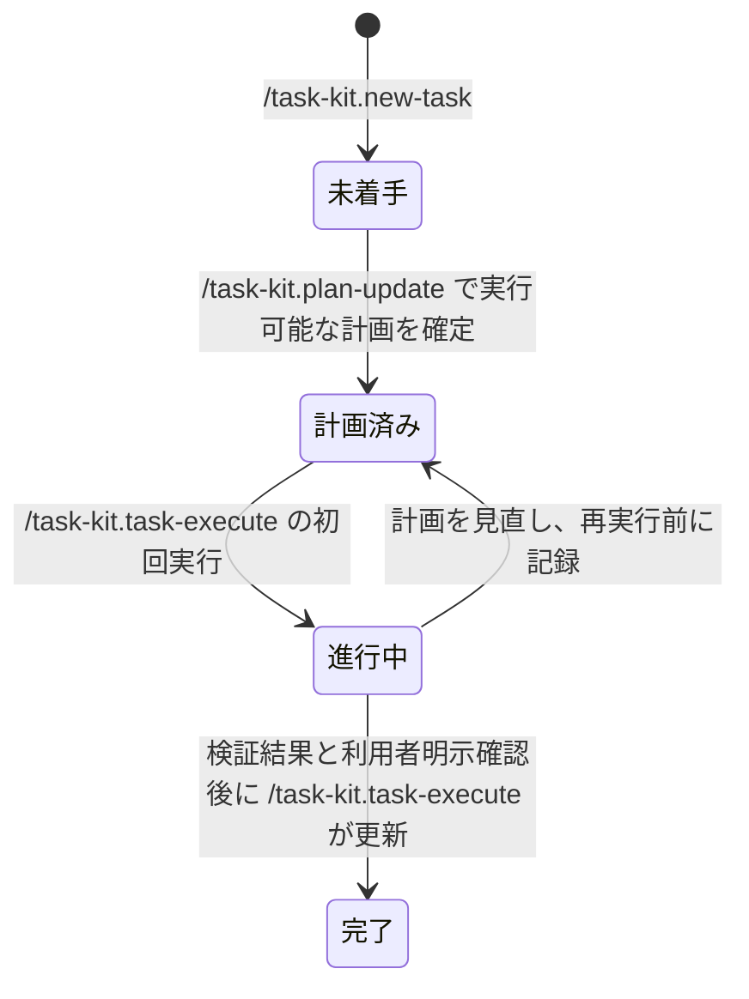

# Task-Kit テンプレート強化差分設計書 v1.0

## 1. 基本情報

- 作成日: 2026-07-10
- 対象: Task-Kit の agent、prompt、タスク雛形の配布テンプレート
- 関連要件: `docs/design/task-kit-requirements-v1.0.md`
- 関連設計: `docs/design/task-kit-solution-design-v1.0.md`
- 関連差分: `docs/design/task-kit-agent-plugin-design-delta-v1.0.md`
- 本書の位置づけ: 承認済み方針を既存 v1.0 文書の置換や大幅改訂を行わずに記録する差分設計書

## 2. 背景と目的

現在のタスク運用では、agent、prompt、タスク雛形の間で、状態遷移、カレントタスク、記録、引継ぎ、およびディレクトリ境界の扱いを同じ契約として維持する必要がある。

特に `/task-kit.review` は `records/findings.md` への追記を指示している一方、対応する review agent に `edit` 権限がない。この不整合を解消し、各テンプレートを一貫して利用できる状態にする。

## 3. 対象と非対象

### 3.1 対象

- `templates/github/agents/` 配下の `task-kit.task.agent.md`、`task-kit.review.agent.md`、`task-kit.plan.agent.md`、`task-kit.execute.agent.md`
- `templates/github/prompts/` 配下の Task-Kit prompt
- `templates/.task-kit/templates/tasks/` 配下の `task.md`、`plan.md`、`findings.md`、`handoff.md` および関連雛形
- `README.md` と `docs/design/collaboration/README.md` の、実在する配布元パスおよび設計書への参照

### 3.2 非対象

- Agent Plugin の追加、`plugin.json`、Plugin 配布経路の実装
- `.task-kit/prompts` の追加または実行資産としての利用
- CLI のコマンド、オプション、終了コードの変更
- `--sync` の dry-run、削除前確認、保護対象の変更
- `tasks/` 配下に作成済みの利用者タスクを一括移行または書き換える処理
- requirements v1.0 および solution-design v1.0 の置換または大幅改訂

## 4. 採用方針

### 4.1 配布正本

`templates/` を唯一の配布正本とする。Task-Kit の agent と prompt は `templates/github/`、タスク作成用の雛形は `templates/.task-kit/templates/tasks/` で管理する。展開先の `.github/`、`.task-kit/`、および `tasks/` は配布正本ではない。

Agent Plugin と `.task-kit/prompts` は実装見送りを維持する。同じ資産を複数の配布元で管理しない。

### 4.2 共通運用契約

agent、prompt、タスク雛形は、次の契約を同じ意味で扱う。

| 論点 | 契約 |
|---|---|
| カレントタスク | 実行前に `.task-kit/current-task.md` を参照する。空または未設定の場合は、対象タスクを推測せず利用者へ確認する。 |
| タスク指定 | タスクパス未指定時は current task を既定値にする。指定値と current task が異なる場合は、操作前に利用者へ確認する。 |
| 状態 | `未着手`、`計画済み`、`進行中`、`完了` を使用する。`/task-kit.new-task` は `未着手`、実行可能な計画を確定した `/task-kit.plan-update` は `計画済み`、初回実行した `/task-kit.task-execute` は `進行中` に更新する。`完了` は検証と利用者の明示確認後に `/task-kit.task-execute` だけが更新する。 |
| 記録 | 確定した事実、判断、懸念と根拠は `records/findings.md` に追記する。作業中の仮説や一時メモは `records/scratchpad.md` に置く。 |
| 完了確認 | `task.md` の新設「完了確認」節を正本とする。完了条件ごとの検証結果、利用者の明示確認、確認日時を記録する。 |
| 引継ぎ | 状態、完了済み事項、未完了事項、再開手順、参照先、リスクを `handoff.md` で追跡できるようにする。 |
| ディレクトリ境界 | `references/` は参照専用、`outputs/` は成果物、`records/` は運用記録とする。用途をまたぐ書き込みを行わない。 |

### 4.3 既存雛形との互換性

`task.md`、`plan.md`、`records/findings.md`、`handoff.md` は既存見出しを維持する。強化は既存見出し配下の項目追加、または末尾への追記に限る。例外として、`task.md` には完了確認の正本となる新設「完了確認」節を末尾に追加する。既存項目の削除、改名、並べ替えは行わない。

### 4.4 review agent の編集権限

review agent がレビューで新たに特定した事実、欠陥、根拠を `records/findings.md` へ記録するため、agent に `edit` 権限を付与する。agent 指示では、編集を対象タスク配下の `records/findings.md` への追記だけに限定する。レビュー対象、`task.md`、`plan.md`、`handoff.md`、`references/`、`outputs/`、`records/scratchpad.md` は編集しない。

### 4.5 完了状態

`完了` への遷移は、`task.md` の「完了確認」節にすべての完了条件の検証結果と利用者の明示確認を記録した場合に限る。agent または prompt が、実装・レビュー・成果物生成の終了だけを根拠に完了へ自動遷移させてはならない。

### 4.6 プロンプト作成・実行のセッション分離

計画を作成する会話と、その計画を実行する会話は、会話履歴を共有しない別セッションとして扱う。これは実行環境の会話履歴を技術的に消去または検証する機能ではなく、Task-Kit が利用者へ新規セッションを明示的に案内し、自己完結した入力を提供する運用上の境界である。

- `task-kit.plan` は実行可能な計画を確定したとき、新規セッションの開始を案内し、`実行セッションパッケージ` をコードブロックで出力する。パッケージには `/task-kit.task-execute`、タスクパス、対象ステップ、参照してよい `plan.md`・`issue.md`・補助資料のパス、実行制約、受け入れ条件、検証方法、期待する出力形式を含める。
- `task-kit.execute` は、`実行セッションパッケージ` を含まない直接の呼出しでは、ファイル作成・更新、状態遷移、外部操作を行わない。必要な一次入力を参照してパッケージを作成し、新規セッションに貼り付けるよう案内して終了する。
- 新規セッションでパッケージを貼り付けて呼び出された `task-kit.execute` は、パッケージと一次入力を突き合わせた後、既存の複雑度判定、利用者確認、実施、検証、記録の手順へ進む。前セッションの会話履歴や未確定な仮説を根拠にしてはならない。
- パッケージに含められない入力は、推測で補わず、利用者確認事項または参照ファイルのパスとして明示する。秘密情報、個人情報、他タスクの文脈、会話履歴そのものをパッケージへ含めない。

## 5. 責務境界

| 領域 | 責務 | 更新主体 |
|---|---|---|
| `templates/github/agents/` | 実行権限、操作制約、共通運用契約の定義 | Task-Kit 保守者 |
| `templates/github/prompts/` | コマンドごとの入力、手順、出力、agent への委譲 | Task-Kit 保守者 |
| `templates/.task-kit/templates/tasks/` | 新規タスクに複製する文書構造と記録形式 | Task-Kit 保守者 |
| `.task-kit/current-task.md` | 利用者が選択した現在のタスク参照 | 利用者の同意を得た task agent |
| `tasks/*/references/` | 入力資料、根拠資料 | 利用者または外部入力。agent は参照のみ |
| `tasks/*/outputs/` | 成果物 | task agent。review agent は編集しない |
| `tasks/*/records/findings.md` | 確定した事実、判断、懸念と根拠 | task agent、review agent。ただし review agent は追記だけ |
| `tasks/*/handoff.md` | 再開可能な状態の引継ぎ | task agent または利用者 |

`task-kit.plan` は実行セッションパッケージを生成するが、実行や状態遷移は行わない。`task-kit.execute` はパッケージの入口を検査し、分離されていない直接実行を新セッションへ誘導する。いずれも会話セッションの技術的な生成・消去・真正性の検証は担当しない。

## 6. 状態遷移

- 状態を変更する際は、`task.md` のステータスと `handoff.md` の現在地を矛盾させない。
- `完了` への更新時は、`task.md` の「完了確認」節に検証結果、利用者確認、確認日時を記録する。
- 完了条件の未検証、利用者確認待ち、ブロッカー、未完了ステップがある場合は `完了` に遷移しない。
- review agent は状態を変更しない。指摘は findings に記録し、完了判断は利用者へ委ねる。

## 7. CLI と同期の運用制約

`task-kit init --sync` は、配布元に存在しない既知の Task-Kit 管理テンプレートだけを削除する。dry-run と削除前確認は提供しない。

- 削除対象: `.github/agents/task-kit.*`、`.github/prompts/task-kit.*`、`.github/skills/task-kit-*`、`.task-kit/prompts/task-kit.*`、および `.task-kit/templates/` 配下の既知の Task-Kit 管理テンプレート
- 保護対象: `tasks/`、`.task-kit/current-task.md`、`.task-kit/defaults/user-profile.md`、Task-Kit 接頭辞を持たない資産、および `.task-kit/templates/` 配下の利用者独自テンプレート
- 利用者独自テンプレートは `.task-kit/templates/` に配置してよい。CLI は Task-Kit が配布するテンプレート以外の作成、更新、削除に関与しない。

## 8. README と索引の整合

- `README.md` は実在する配布元 `templates/github/agents/`、`templates/github/prompts/`、`templates/.task-kit/templates/tasks/` と、展開先 `.github/`、`.task-kit/` を区別して記載する。
- `docs/design/collaboration/README.md` は一次情報への導線に限定し、prompt の参照先を `templates/github/prompts/` とする。
- Agent Plugin または `.task-kit/prompts` を実装済みであるように README や索引へ記載しない。
- 新しい設計判断の参照先は本書とし、既存 requirements v1.0 および solution-design v1.0 の記載を重複させない。
- 本書をテンプレート強化の最優先根拠とする。Agent Plugin 追加設計書の Plugin 関連節は、この範囲の実装根拠にしない。

## 9. 受け入れ条件

1. agent、prompt、タスク雛形のいずれからも、空の current task、指定タスクとの不一致、記録先、引継ぎ先、`references/`、`outputs/`、`records/` の境界を矛盾なく判断できる。
2. `task.md`、`plan.md`、`records/findings.md`、`handoff.md` の既存見出しが残り、変更が追記だけであることを差分で確認できる。
3. review agent に `edit` 権限があり、レビュー時の編集対象が `records/findings.md` への追記だけに限定されている。
4. `/task-kit.review` は findings を必要に応じて追記できるが、レビュー対象や状態を変更しない。
5. `完了` 遷移には、全完了条件の検証結果と利用者の明示確認が必要である。
6. Plugin、`.task-kit/prompts`、dry-run、削除前確認が追加されていない。
7. `--sync` が利用者独自テンプレートを削除せず、配布元に存在しない既知の Task-Kit 管理テンプレートだけを削除する。
8. README と協業索引に記載したテンプレート参照先がリポジトリ内に実在する。
9. `task-kit.plan` は実行可能な計画の確定時に、自己完結した実行セッションパッケージと新規セッション開始の案内を出力する。
10. `task-kit.execute` はパッケージなしの直接呼出しで書込み・状態遷移・外部操作をせず、新規セッション用パッケージを出力する。パッケージを含む新規セッションからの呼出しだけが、既存の実行手順へ進む。
11. 実行セッションパッケージに会話履歴、未確定事項、秘密情報、個人情報、他タスク文脈を含めず、実行に必要な目的、参照先、制約、受け入れ条件、検証方法、出力形式を含める。

## 10. リスクと未解決事項

| 種別 | 内容 | 対応方針 | 状態 |
|---|---|---|---|
| リスク | 雛形追記時に既存見出しを変更すると、既存 prompt の参照が壊れる | 見出しの削除・改名・並べ替えを禁止し、差分確認を行う | 管理 |
| リスク | review agent の edit 権限が records 外へ拡張される | agent 定義と prompt に records 限定を明記し、受け入れ確認する | 管理 |
| リスク | 既知の Task-Kit 管理テンプレートと利用者独自テンプレートを同期処理で誤判定する | CLI は既知の Task-Kit 管理テンプレートだけを削除対象として判定する | 管理 |
| 未解決 | 既知の Task-Kit 管理テンプレートの識別方式 | 初期実装では配布済みの既知パスを管理し、将来のマニフェスト化は別途判断する | 未解決 |
| 見送り | Agent Plugin と `.task-kit/prompts` の配布・認識方式 | 本差分の対象外として維持し、再開時は別設計で扱う | 見送り |
| 制約 | 新規セッションであることを実行環境が技術的に証明できない | パッケージを唯一の実行入口として運用し、利用者への新規セッション案内を明示する | 管理 |

## 11. 既存文書との関係

- requirements v1.0 の「Agent Plugin 方式と `.task-kit/prompts` の追加は見送る」「`--sync` は dry-run を提供しない」という確定事項を具体化する。
- solution-design v1.0 のテンプレート配布、タスク状態、ディレクトリ構成、保護対象は、本書の差分に従って解釈する。
- Agent Plugin 追加設計書の Plugin 関連節は実装根拠にしない。本書はテンプレート配布正本と運用契約の最優先根拠である。
- 将来 Plugin を再検討する場合も、本書で定めるテンプレート正本とタスク運用境界を先に維持する。

## 12. implementation-coder への実装引継ぎ

### 実装順序

1. `templates/github/agents/` の task agent と review agent に共通運用契約を反映する。review agent には `edit` を付与し、`records/findings.md` への追記以外を禁止する。
2. `templates/github/prompts/` の各 prompt を、空の current task、不一致時確認、状態遷移、記録先、引継ぎ、ディレクトリ境界で agent と一致させる。`task-kit.plan-update` と `task-kit.task-execute` は実行セッションパッケージの入出力契約も一致させる。
3. `templates/.task-kit/templates/tasks/` の `task.md` に「完了確認」節を追加し、`plan.md`、`records/findings.md`、`handoff.md` へ必要項目を追記する。既存見出しは維持する。
4. CLI 同期処理を、既知の Task-Kit 管理テンプレートだけを削除し、利用者独自テンプレートを保持する実装へ更新する。
5. README と協業索引の配布元参照と同期契約を更新する。
6. agent/prompt の静的確認、CLI 同期テスト、およびテンプレートから作成したタスクでの運用シナリオ確認を行う。

### 検証観点

- current task が空のとき、対象タスクを確認してから更新・実行・レビューすること。
- task path と current task が不一致のとき、対象選択を確認すること。
- `references/` へ書き込まず、成果物を `outputs/`、記録を `records/` に置くこと。
- review agent が findings を追記でき、`records/findings.md` 以外を編集しないこと。
- 未検証の完了条件または利用者未確認の状態で `完了` へ遷移せず、利用者確認後に task-execute が更新すること。
- `task-kit init --sync` が利用者独自テンプレートを保持し、配布元にない既知の Task-Kit 管理テンプレートだけを削除すること。
- 実行可能な計画を確定した `task-kit.plan` が、新規セッションへの案内と必須項目を含む実行セッションパッケージを出力すること。
- パッケージなしで直接起動した `task-kit.execute` が書込み・状態遷移・外部操作を行わず、パッケージを出力して停止すること。パッケージを貼り付けた起動では既存の複雑度判定へ進むこと。

### 実装完了の判断

本書の受け入れ条件を満たし、既存 requirements v1.0、solution-design v1.0、CLI README と矛盾しないことを確認して完了とする。テンプレート強化に関しては本書を最優先根拠とし、Agent Plugin 追加設計書の Plugin 関連節は参照しない。
